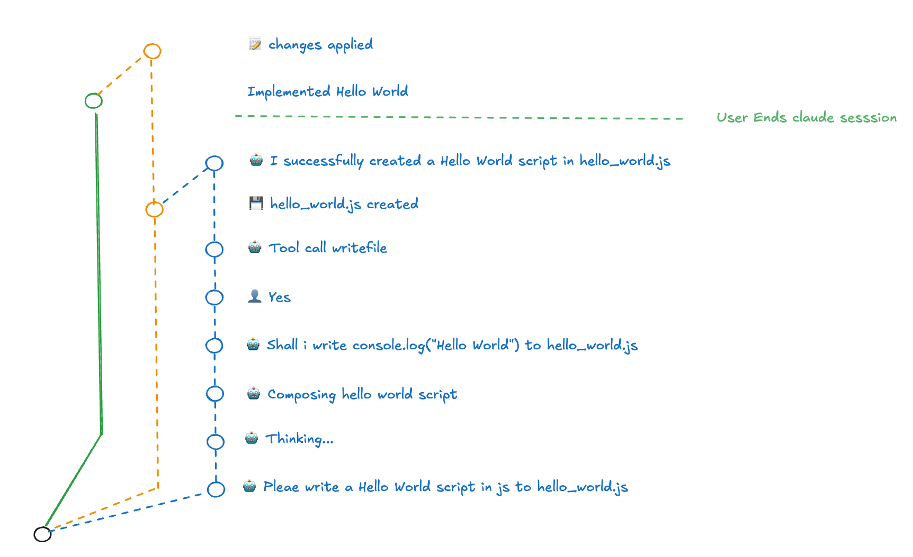

# Legit Code

Dont fear to close that terminal tap!

> [!NOTE]
> This is a dogfood project to show off a concept based on [Legit](https://www.legitcontrol.com/) please use with care

Store (and share) your AI coding conversations in your Git repository - right next to your code.

## Quickstart

```bash
npx legit-code
```

## Watch it in action


## What is Legit Code?

`legit-code` is a CLI wrapper around Claude that automatically stores your AI conversations in your Git repository. Every prompt, every response, and every code change becomes part of your project's history - searchable, reviewable, and preserved forever.

## Prerequisites

Before you get started, make sure you have:

## Requirements

- Node.js (v14 or higher)
- macOS (for NFS mounting support)
- **[npm](https://docs.npmjs.com/downloading-and-installing-node-js-and-npm)** installed - Node.js package manager
- Git repository initialized in your project directory
- **[Claude Code CLI](https://github.com/anthropics/claude-code)** installed - The official Claude CLI for coding assistance

## Getting Started

##### 1. Install the CLI globally using npm:

```bash
npm install -g legit-code
```

##### 2. Navigate to Your Repository

```bash
cd /path/to/your/repository
```

### 3. Start legit-code

```bash
legit-code
```

### 4. Work with Claude

Use Claude naturally - ask questions, request code changes, explore solutions. Every interaction is automatically captured.

### 6. Close Legit Code

Closing claude (cmd + c, cmd + c) will prompt you if you want to:

- continue later
- apply the changes
- or revert the changes (WIP)

When you're done, exit legit-claude you can see the history in your git graph:

```bash
git log --graph --oneline --all
```

You'll see:

- Your prompts as commit messages
- Claude's responses in commit metadata
- Code changes in the diffs
- The complete conversation timeline in the branch structure



## How It Works

### NFS Mounting

Legit Code uses Network File System (NFS) mounting to intercept File read and writes done by claude cli:

So Legit-code:

1. Spawns an NFS server backed by [LegitFS](https://www.legitcontrol.com/docs/concepts/filesystem-api)
2. Mounts the repository locally (current folder + `-nfs`)
3. Starts Claude within the mounted folder

This allows Legit to track all changes made to that folder and also intercept Claude's interactions with the session files.

When Claude-cli stores its prompt - this will directly fowared to legitfs and stored into a commit - when claude cli reads a file the projection in the other direction takes place.

## Continuing an Existing Session

To continue a previous session:

```bash
legit-code
```

You'll be prompted to select from existing sessions, or you can create a new one.

## Why Use Legit Code?

- **Never lose context**: Your AI conversations are preserved with your code
- **Team collaboration**: Share AI sessions and decision-making rationale
- **Searchable history**: Use Git to find past solutions and discussions
- **Review process**: See exactly how and why code was changed
- **Learning tool**: Review your problem-solving process over time

## Technical Details

### Legit Framework Integration

Legit Code uses the Legit SDK for version-controlled file systems:

- **Core SDK** (`@legit-sdk/core`) — Version control engine
- **NFS Server** (`@legit-sdk/nfs-serve`) — Exposes repository over NFS

## Related Projects

- [Legit Chat](https://www.legitcontrol.com/docs/concepts/chat-app) — Agentic communication with conversation history
- [Legit SDK](https://www.legitcontrol.com/docs) — Version-controlled file systems
